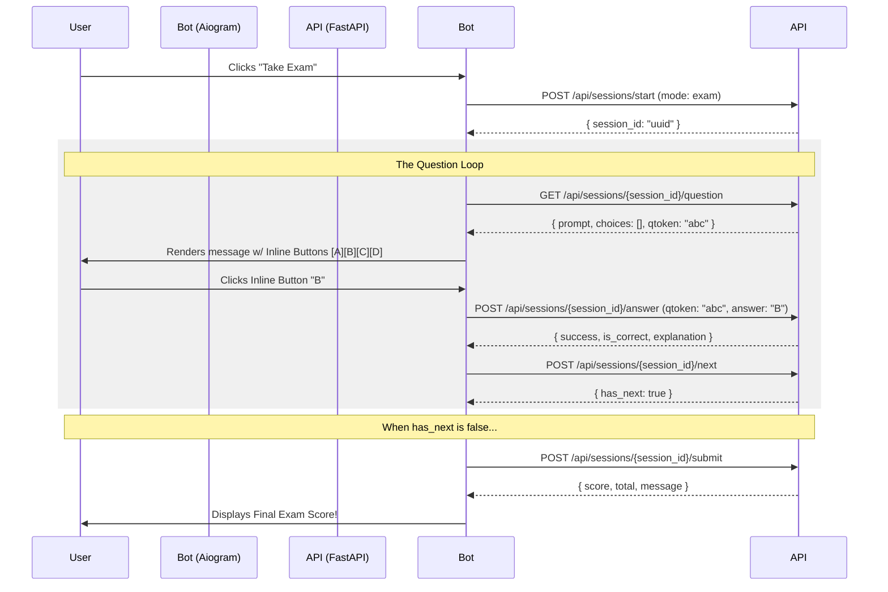
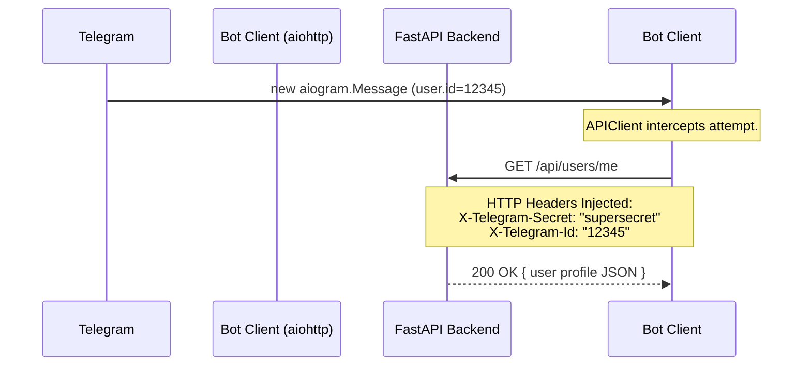

# TeleExam AI - Telegram Bot Frontend Specification (SRS & SDS)

## 1. Project Context & Vision
TeleExam AI is an advanced, high-concurrency educational platform delivered over Telegram. It allows students in Ethiopia to take rigorous mock exams, practice specific subject topics, and receive instant, personalized AI tutoring (including pedagogical explanations, dynamic chat, and predictive study plans).

The backend is a completely stateless, high-performance **FastAPI** monolith backed by PostgreSQL, Redis, and Groq LLMs via LangGraph. 

**Your Priority Goal as the AI Bot Developer**: Build the Telegram Bot frontend using Python's `aiogram 3.x`. You are building a pure presentation/translation layer. Your bot must hold **NO** persistent application state, require **NO** database, and perform **NO** educational business logic. It simply accepts Telegram `Update`s, securely calls the FastAPI backend via REST, and renders the JSON responses into beautiful interactive Telegram messages (using Inline Keyboards).

---

## 2. Software Requirements Specification (SRS)

### Functional Requirements
1. **Onboarding / Authentication**: The bot must automatically register/update the user by parsing their Telegram profile every time they start an interaction.
2. **Main Menu**: Provide an intuitive `ReplyKeyboardMarkup` for seamless navigation.
3. **Session Modes**:
   - **Exam Mode**: Sequential question delivery. Strict answers. No explanations.
   - **Practice & Quiz Modes**: Sequential questions, but allows triggering AI Explanations per question.
4. **AI Tutoring**: Must provide an inline button to request AI explanations for questions, and permit follow-up chats.
5. **Study Plans**: Fetch and beautifully format predictive 7-day study plans (JSON to Markdown calendar conversion).
6. **Referrals**: Allow users to generate and share deep-links (`t.me/Bot?start=ref_123`) to earn rewards.

### Non-Functional Requirements
1. **Scalability**: Must support 1,000+ concurrent requests. Long-polling is expressly forbidden in production. Must use **Webhooks** via `aiohttp.web`.
2. **Statelessness**: No local SQLite databases. Flow control is managed by `aiogram.fsm` (which can eventually use RedisStorage).
3. **100% Free Hosting**: Production configuration targets Render Web Service Free Tier or PythonAnywhere.
4. **Security**: Ensure absolute zero leakage of backend APIs, secret tokens, or user data. Open-source friendly.

---

## 3. Software Design Specification (SDS) & Architecture

### A. Folder Architecture (Modular Design)
```text
telegram-bot/
├── .env.example              # MUST be committed. Contains blank templates.
├── .gitignore                # MUST ignore .env, .venv, __pycache__, logs/
├── requirements.txt          # aiogram==3.x, aiohttp==3.x
├── run.py                    # Webhook server entrypoint
├── bot/
│   ├── config.py             # Loads .env vars via pydantic-settings or os.getenv
│   ├── middlewares/
│   │   └── auto_upsert.py    # Intercepts updates to auto-call POST /users/upsert
│   ├── services/
│   │   └── api_client.py     # aiohttp ClientSession singleton
│   ├── states/
│   │   └── session_states.py # aiogram StatesGroups (ExamInProgress, AIChatting)
│   ├── keyboards/
│   │   ├── reply.py          # Main Menu (Take Exam, Practice, Study Plan)
│   │   └── inline.py         # Question Options (A, B, C, D) & AI Explain buttons
│   └── routers/
│       ├── onboarding.py     # /start, deep-links
│       ├── sessions.py       # Handling /api/sessions/* (Start, Question, Answer, Next)
│       └── ai_tutor.py       # Handling /api/ai/* (Explain, Chat, Study Plan)
```

### B. Security & `.gitignore`
Before writing ANY code, generate a strict `.gitignore` to prevent leaking the backend configuration.
**`.gitignore` rules:**
```
.env
__pycache__/
*.pyc
logs/
.venv/
env/
```

The secrets required by the bot are:
- `BOT_TOKEN`: The Telegram Bot token from BotFather.
- `BACKEND_URL`: `http://127.0.0.1:8000` (local) or production HTTPS URL.
- `BACKEND_SECRET`: The shared security string (e.g., `my_secret_key`). **Must be sent in EVERY request as the `X-Telegram-Secret` header.**

---

## 4. Integration & Sequence Diagrams (To help the AI Agent)

### Diagram 1: The Core Exam Session Loop
When the user clicks "Take Exam", the exact sequence is:



### Diagram 2: Authentication Handshake (Middleware)
For EVERY request, the backend relies completely on the Bot establishing who the user is using HTTP Headers.



---

## 5. Detailed Backend Endpoint Integration Guide

### 1. `POST /api/users/upsert`
- **When to call**: Inside an aiogram Middleware, ensuring it runs on every new session, or heavily driven through `/start`.
- **Payload**: `{"telegram_id": int, "telegram_username": str, "first_name": str, "last_name": str}`
- **Purpose**: Registers the user on the backend. If they clicked a referral link (`/start ref_xyz`), append `{"invite_code": "xyz"}` to the payload.

### 2. `POST /api/sessions/start`
- **When to call**: When user presses "Take Exam" or "Practice".
- **Payload**: `{"mode": "exam" | "practice" | "quiz", "course_id": Optional[UUID]}`
- **Response**: Yields `session_id`. Store this temporarily in `aiogram.fsm`.

### 3. `GET /api/sessions/{session_id}/question`
- **When to call**: Immediately after starting a session, OR after calling `/next`.
- **Response**: `{"prompt": "What is...", "choices": [...], "qtoken": "xyz"}`.
- **Bot Action**: Send a Telegram message containing the `prompt` text, and build an `InlineKeyboardMarkup` representing the choices. **Keep `qtoken` safely in FSM state**, it acts as an anti-cheat mechanism.

### 4. `POST /api/sessions/{session_id}/answer`
- **When to call**: When the user clicks an InlineChoice button in Telegram (`CallbackQuery`).
- **Payload**: `{"qtoken": "xyz", "answer": "text_of_their_choice" }`.
- **Bot Action**: Acknowledge the callback. Tell the user if they were right/wrong (if in Practice mode), then present a "Next Question" button OR automatically call `/next`.

### 5. `POST /api/sessions/{session_id}/next`
- **When to call**: After answering a question, to officially load the upcoming question.
- **Response**: `{"has_next": bool}`. If `true`, loop back to `/question`. If `false`, call `/submit`.

### 6. `POST /api/ai/explain`
- **When to call**: Available in Practice mode. When user clicks "Explain this using AI".
- **Payload**: `{"question_id": "uuid", "user_answer": "their_answer"}`
- **Response**: A beautiful highly-pedagogical explanation.
- **Bot Action**: Display it using clean Telegram Markdown/HTML. 

### 7. `POST /api/ai/study-plan`
- **When to call**: User clicks "My Study Plan" from main menu.
- **Response**: Predictive plan based on weak topics. Fails with 402 if the user hasn't finished at least 1 mock exam natively. Catch the `aiohttp` error and tell the user!
